# Katalog Buku
```
Nama   : Fathan Atallah Rasya Nugraha
NIM    : 312410425
Kelas  : Ti.24.A3
```

## Halaman Login
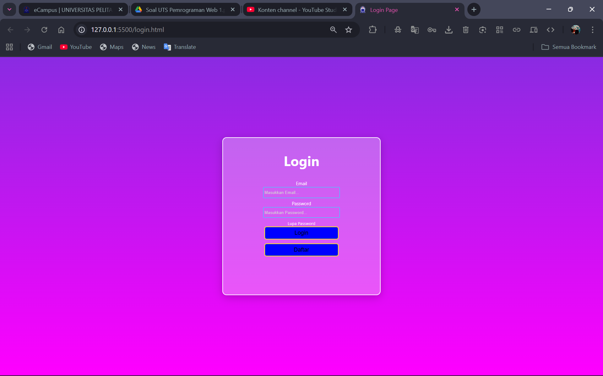<br>
Ini adalah tampilan awal dari website katalog buku saya, terlihat simpel dan segar di mata.
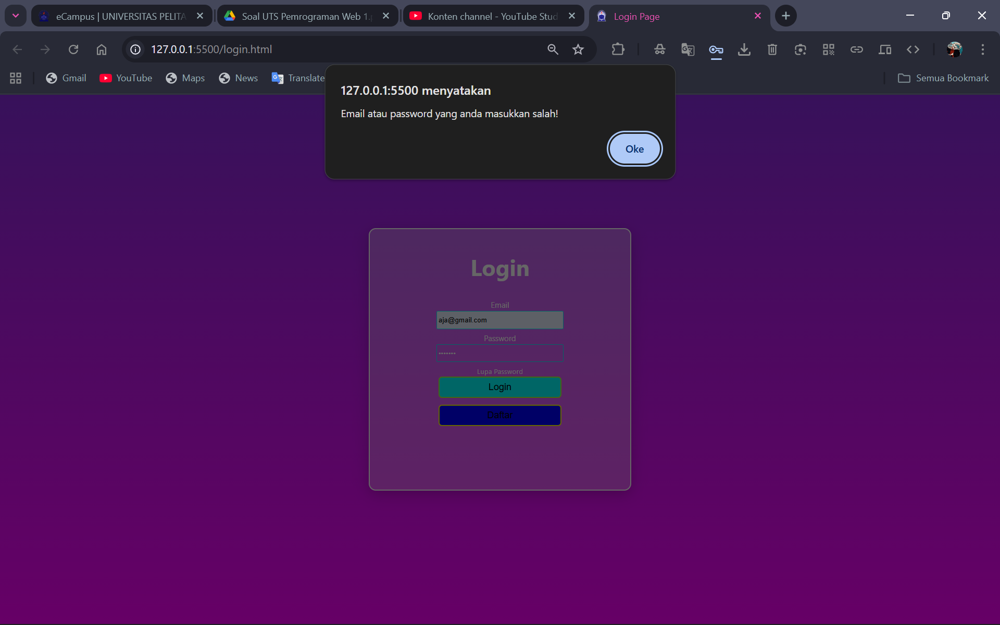<br>
Ini akan ditampilkan ketika user salah mengetikkan alamat email dan password.
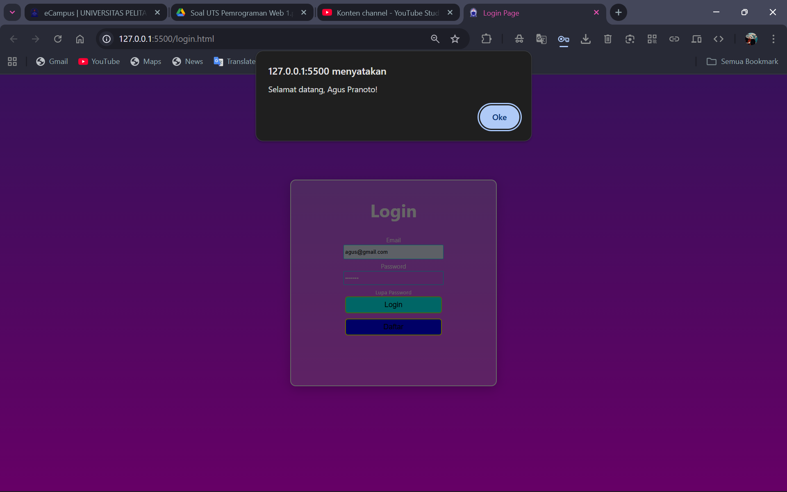<br>
Dan ini yang akan ditampilkan ketika user berhasil login dengan memasukkan alamat email dan password yang benar.
<br>
Sebelum itu ada beberapa tombol yang juga berfungsi seperti tombol lupa password, ketika di tekan akan memunculkan sebuah kotak seperti ini.
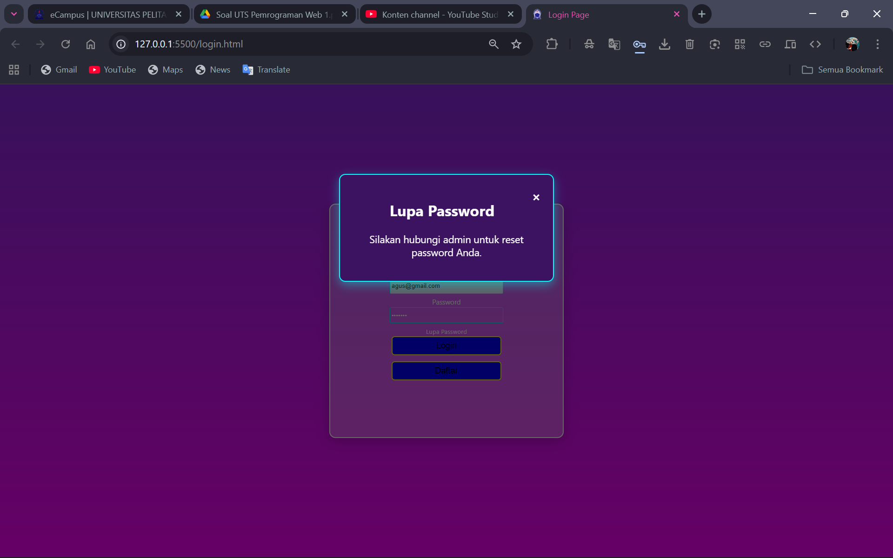<br>
Dan ada juga tombol untuk daftar atau sign up, tampilannya akan seperti ini ketika ditekan.
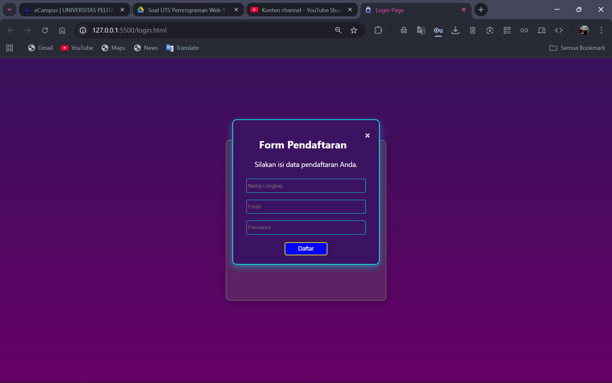<br>
Dengan begitu ketika tombol login ditekan dan email serta password yang dimasukkan benar, maka user akan dialihkan ke dashboard.html
### HTML Code
```html
<!DOCTYPE html>
<html lang="en">
<head>
  <meta charset="UTF-8" />
  <meta name="viewport" content="width=device-width, initial-scale=1.0" />
  <title>Login Page</title>
  <link rel="shortcut icon" href="assets/logo.png" type="image/x-icon" />
  <link rel="stylesheet" href="css/style.css" />
</head>
<body>
  <div id="container">
    <form id="loginForm">
      <h1>Login</h1>

      <div class="email">
        <label for="email">Email</label><br />
        <input type="email" id="email" placeholder="Masukkan Email..." required />
        <div id="emailError"></div>
      </div>

      <div class="pw">
        <label for="password">Password</label><br />
        <input type="password" id="password" placeholder="Masukkan Password..." required />
        <div id="passwordError"></div>
      </div>

      <a type="button" id="lupaPwBtn">Lupa Password</a><br>
      <button type="submit" class="login">Login</button><br />
      <button type="button" id="daftarBtn">Daftar</button>
    </form>
  </div>

  <div id="modalLupaPw" class="modal">
    <div class="modal-content">
      <span class="close" id="closeLupaPw">&times;</span>
      <h2>Lupa Password</h2>
      <p>Silakan hubungi admin untuk reset password Anda.</p>
    </div>
  </div>

  <div id="modalDaftar" class="modal">
    <div class="modal-content">
      <span class="close" id="closeDaftar">&times;</span>
      <h2>Form Pendaftaran</h2>
      <p>Silakan isi data pendaftaran Anda.</p>
      <form id="registerForm">
        <input type="text" id="name" placeholder="Nama Lengkap" /><br />
        <input type="email" id="regEmail" placeholder="Email" /><br />
        <input type="password" id="regPassword" placeholder="Password" /><br />
        <button type="submit">Daftar</button>
      </form>
    </div>
  </div>

  <script src="js/data.js"></script>
  <script src="js/script.js"></script>
</body>
</html>
```
### JS Code
```js
const formLogin = document.getElementById("loginForm");
const lupaPwBtn = document.getElementById("lupaPwBtn");
const daftarBtn = document.getElementById("daftarBtn");

const modalLupaPw = document.getElementById("modalLupaPw");
const modalDaftar = document.getElementById("modalDaftar");
const closeLupaPw = document.getElementById("closeLupaPw");
const closeDaftar = document.getElementById("closeDaftar");

formLogin.addEventListener("submit", function (event) {
  event.preventDefault();

  const email = document.getElementById("email").value.trim();
  const password = document.getElementById("password").value.trim();

  const user = dataPengguna.find(
    (pengguna) => pengguna.email === email && pengguna.password === password
  );

  if (user) {
    alert(`Selamat datang, ${user.nama}!`);
    window.location.href = "dashboard.html";
  } else {
    alert("Email atau password yang anda masukkan salah!");
  }
});

lupaPwBtn.onclick = () => {
  modalLupaPw.style.display = "block";
};
closeLupaPw.onclick = () => {
  modalLupaPw.style.display = "none";
};

daftarBtn.onclick = () => {
  modalDaftar.style.display = "block";
};
closeDaftar.onclick = () => {
  modalDaftar.style.display = "none";
};

window.onclick = (event) => {
  if (event.target === modalLupaPw) modalLupaPw.style.display = "none";
  if (event.target === modalDaftar) modalDaftar.style.display = "none";
};

const registerForm = document.getElementById("registerForm");
registerForm.addEventListener("submit", function (e) {
  e.preventDefault();
  alert("Pendaftaran berhasil! Silakan login menggunakan akun baru.");
  modalDaftar.style.display = "none";
  registerForm.reset();
});
```

## Dashboard
Didalam dashboard, terdapat main menu dengan tombol yang mengarahkan user ke berbagai halaman dan fitur.

Yang pertama sudah pasti ada Dashboard, dashboard akan menampilkan semua halaman yang ingin dituju user.

Tampilan Dashboard :
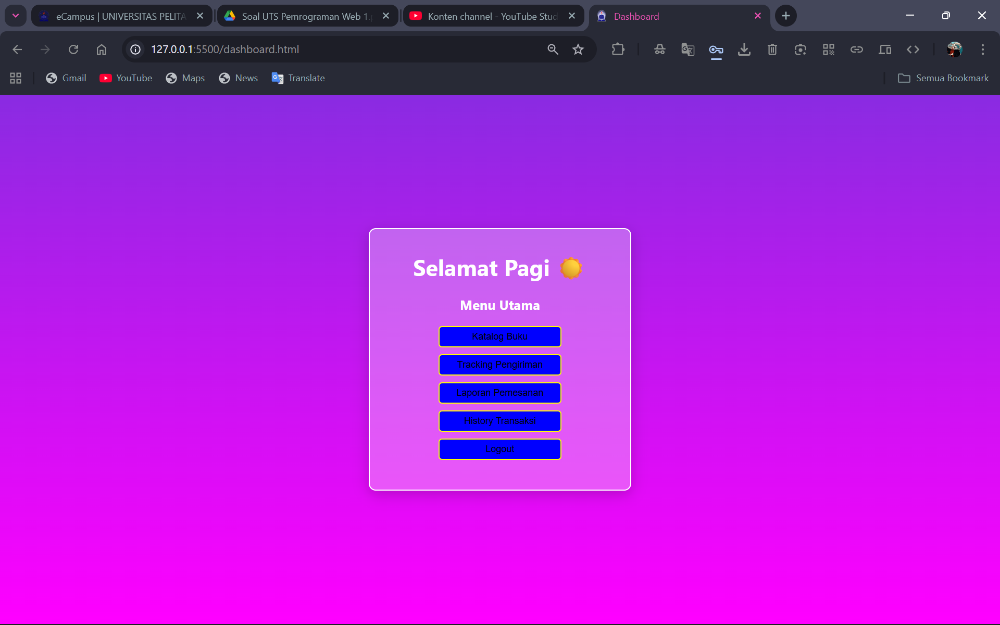<br>
### HTML Code
```html
<!DOCTYPE html>
<html lang="id">
<head>
  <meta charset="UTF-8" />
  <meta name="viewport" content="width=device-width, initial-scale=1.0" />
  <title>Dashboard</title>
  <link rel="stylesheet" href="/css/style.css" />
  <link rel="shortcut icon" href="assets/logo.png" type="image/x-icon" />
</head>
<body>
  <div id="container">
    <h1 id="greeting"></h1>
    <h3>Menu Utama</h3>
    <button onclick="location.href='stok.html'">Katalog Buku</button><br />
    <button onclick="location.href='tracking.html'">Tracking Pengiriman</button><br />
    <button onclick="location.href='checkout.html'">Laporan Pemesanan</button><br />
    <button onclick="alert('Fitur History Transaksi belum diimplementasikan')">History Transaksi</button><br />
    <button onclick="location.href='login.html'">Logout</button>
  </div>

  <script>
    const greetingEl = document.getElementById("greeting");
    const jam = new Date().getHours();
    let greet;
    if (jam < 12) greet = "Selamat Pagi ☀️";
    else if (jam < 17) greet = "Selamat Siang 🌤️";
    else greet = "Selamat Sore 🌙";
    greetingEl.textContent = greet;
  </script>
</body>
</html>
```


## Catalog
Setelah Dashboard, tombol paling atas akan mengalihkan user ke halaman catalog
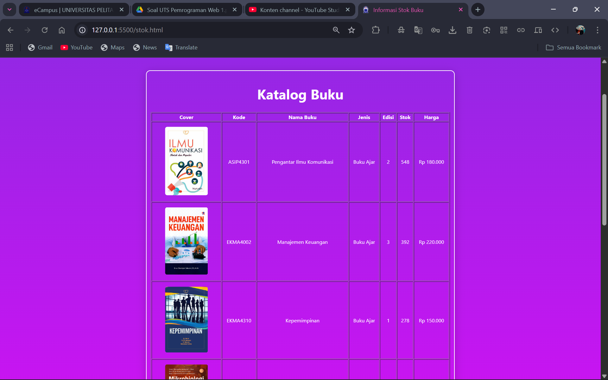<br>
<br>
Disini user bisa melihat-lihat buku yang dijual
dan ada berapa stoknya serta bisa melihat harganya, Admin juga bisa menambahkan buku baru dan set harganya. Tampilannya seperti ini:
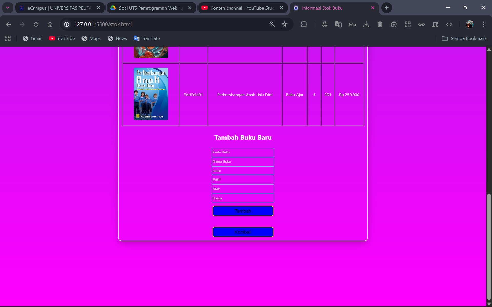<br>

Setelahnya akan muncul alert seperti ini setelah menambahkan buku:
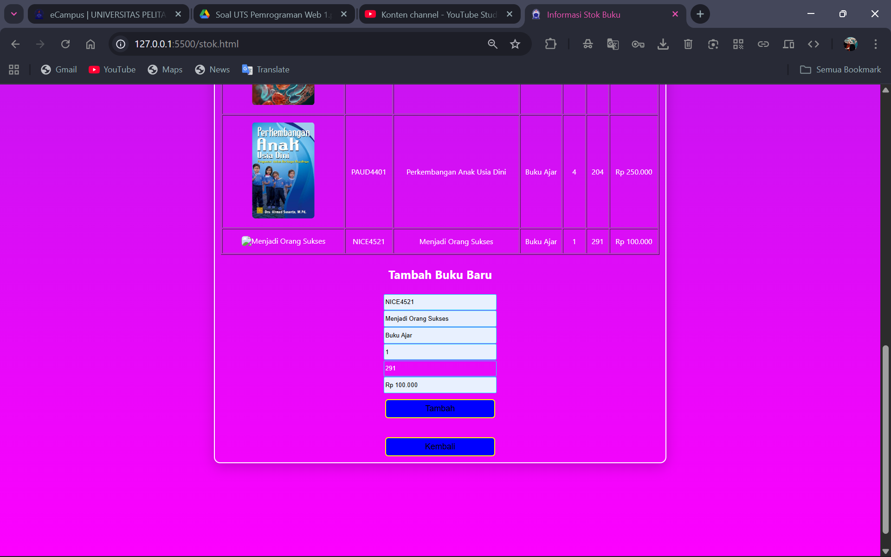<br>

### HTML Code
```html
<!DOCTYPE html>
<html lang="id">
<head>
  <meta charset="UTF-8" />
  <meta name="viewport" content="width=device-width, initial-scale=1.0" />
  <title>Informasi Stok Buku</title>
  <link rel="stylesheet" href="/css/style.css" />
  <link rel="shortcut icon" href="assets/logo.png" type="image/x-icon" />
</head>
<body>
  <div id="containerStok">
    <h1>Katalog Buku</h1>
    <table border="1" width="100%" id="tabelBuku" style="font-size:12px; color:white;">
      <thead>
        <tr>
          <th>Cover</th>
          <th>Kode</th>
          <th>Nama Buku</th>
          <th>Jenis</th>
          <th>Edisi</th>
          <th>Stok</th>
          <th>Harga</th>
        </tr>
      </thead>
      <tbody id="tabelBody"></tbody>
    </table>

    <h3>Tambah Buku Baru</h3>
    <input type="text" id="kode" placeholder="Kode Buku"><br>
    <input type="text" id="nama" placeholder="Nama Buku"><br>
    <input type="text" id="jenis" placeholder="Jenis"><br>
    <input type="text" id="edisi" placeholder="Edisi"><br>
    <input type="number" id="stok" placeholder="Stok"><br>
    <input type="text" id="harga" placeholder="Harga"><br>
    <button id="tambahBuku">Tambah</button><br><br>
    <button onclick="location.href='dashboard.html'">Kembali</button>
  </div>

  <script src="js/data.js"></script>
  <script>
    const tbody = document.getElementById("tabelBody");

    function tampilkanData() {
      tbody.innerHTML = "";
      dataKatalogBuku.forEach((buku) => {
        const row = `
          <tr>
            <td></td>
            <td>${buku.kodeBarang}</td>
            <td>${buku.namaBarang}</td>
            <td>${buku.jenisBarang}</td>
            <td>${buku.edisi}</td>
            <td>${buku.stok}</td>
            <td>${buku.harga}</td>
          </tr>`;
        tbody.innerHTML += row;
      });
    }

    tampilkanData();

    document.getElementById("tambahBuku").onclick = () => {
      const bukuBaru = {
        kodeBarang: document.getElementById("kode").value,
        namaBarang: document.getElementById("nama").value,
        jenisBarang: document.getElementById("jenis").value,
        edisi: document.getElementById("edisi").value,
        stok: parseInt(document.getElementById("stok").value),
        harga: document.getElementById("harga").value,
      };

      if (!bukuBaru.kodeBarang || !bukuBaru.namaBarang) {
        alert("Kode dan Nama Buku wajib diisi!");
        return;
      }

      dataKatalogBuku.push(bukuBaru);
      tampilkanData();
      alert("Buku baru berhasil ditambahkan!");
    };
  </script>
</body>
</html>
```

## Tracking
Fitur ini berguna bagi orang yang ingin melihat paket buku yang di pesannya :
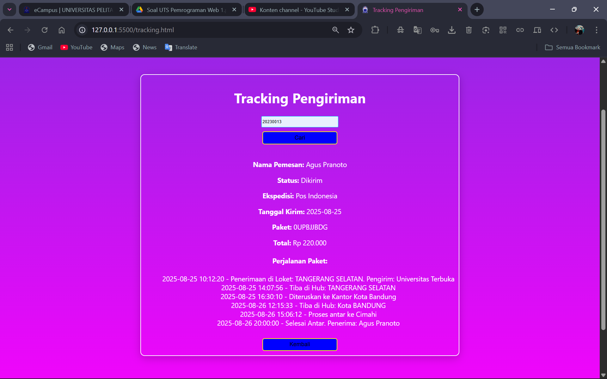<br>
Hanya 3rd place juga timnya tetap balatro

### HTML COde
```html
<!DOCTYPE html>
<html lang="id">
<head>
  <meta charset="UTF-8" />
  <meta name="viewport" content="width=device-width, initial-scale=1.0" />
  <title>Tracking Pengiriman</title>
  <link rel="stylesheet" href="/css/style.css" />
  <link rel="shortcut icon" href="assets/logo.png" type="image/x-icon" />
</head>
<body>
  <div id="containerTrack">
    <h1>Tracking Pengiriman</h1>
    <input type="text" id="noDO" placeholder="Masukkan Nomor DO"><br>
    <button id="btnCari">Cari</button><br><br>
    <div id="hasilTracking"></div>
    <button onclick="location.href='dashboard.html'">Kembali</button>
  </div>

  <script src="js/data.js"></script>
  <script>
    const hasilDiv = document.getElementById("hasilTracking");
    document.getElementById("btnCari").onclick = () => {
      const kode = document.getElementById("noDO").value.trim();
      const data = dataTracking[kode];
      if (data) {
        let perjalananHTML = "";
        data.perjalanan.forEach((step) => {
          perjalananHTML += `<li>${step.waktu} - ${step.keterangan}</li>`;
        });
        hasilDiv.innerHTML = `
          <p><b>Nama Pemesan:</b> ${data.nama}</p>
          <p><b>Status:</b> ${data.status}</p>
          <p><b>Ekspedisi:</b> ${data.ekspedisi}</p>
          <p><b>Tanggal Kirim:</b> ${data.tanggalKirim}</p>
          <p><b>Paket:</b> ${data.paket}</p>
          <p><b>Total:</b> ${data.total}</p>
          <h4>Perjalanan Paket:</h4>
          <ul>${perjalananHTML}</ul>
        `;
      } else {
        hasilDiv.innerHTML = "<p style='color:yellow;'>Nomor DO tidak ditemukan.</p>";
      }
    };
  </script>
</body>
</html>
```

## DO / Pemesanan
Pemesanan buku, secara online. Pengguna bisa membeli buku dibagian ini. Tampilannya :
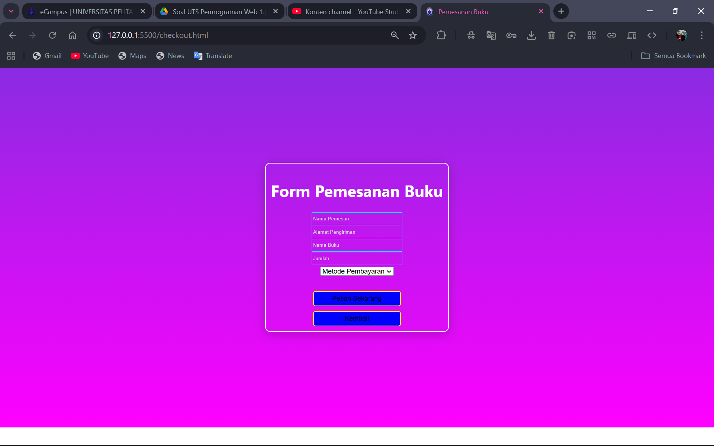<br>
### HTML Code
```html
<!DOCTYPE html>
<html lang="id">
<head>
  <meta charset="UTF-8" />
  <meta name="viewport" content="width=device-width, initial-scale=1.0" />
  <title>Pemesanan Buku</title>
  <link rel="stylesheet" href="/css/style.css" />
  <link rel="shortcut icon" href="assets/logo.png" type="image/x-icon" />
</head>
<body>
  <div id="containerCheck">
    <h1>Form Pemesanan Buku</h1>
    <form id="formPemesanan">
      <input type="text" id="namaPemesan" placeholder="Nama Pemesan" required><br>
      <input type="text" id="alamat" placeholder="Alamat Pengiriman" required><br>
      <input type="text" id="buku" placeholder="Nama Buku" required><br>
      <input type="number" id="jumlah" placeholder="Jumlah" required><br>
      <select id="pembayaran">
        <option value="">Metode Pembayaran</option>
        <option value="Transfer Bank">Transfer Bank</option>
        <option value="E-Wallet">E-Wallet</option>
        <option value="COD">COD</option>
      </select><br><br>
      <button type="submit">Pesan Sekarang</button><br>
      <button type="button" onclick="location.href='dashboard.html'">Kembali</button>
    </form>
  </div>

  <script>
    document.getElementById("formPemesanan").addEventListener("submit", function(e){
      e.preventDefault();
      const nama = document.getElementById("namaPemesan").value;
      const buku = document.getElementById("buku").value;
      const jumlah = document.getElementById("jumlah").value;
      const bayar = document.getElementById("pembayaran").value;
      alert(`Terima kasih ${nama}! Pesanan ${jumlah} buku "${buku}" dengan metode ${bayar} telah diterima.`);
      this.reset();
    });
  </script>
</body>
</html>
```

## CSS
Berikut adalah css yang digunakan untuk seluruh file :
```css
/*Universal*/
body {
    margin: 0;
    padding: 0;
    align-items: center;
    background: linear-gradient(blueviolet, magenta);
    background-repeat: no-repeat;
    background-size: cover;
    color: white;
    display: flex;
    justify-content: center;
    margin: 190px 40px;
    font-family: 'Segoe UI', Tahoma, Geneva, Verdana, sans-serif;
}
/*Login Page*/
#container {
    width: 350px;
    height: 350px;
    text-align: center;
    border: 2px solid white;
    padding: 10px;
    box-shadow: 0 5px 20px rgba(0, 0, 0, 0.2);
    border-radius: 10px;
    background-color: rgba(255, 255, 255, 0.3);
}
#container label {
    font-size: 11px;
}
#container input {
    width: 175px;
    height: 20px;
    background-color: transparent;
    border: 1px solid cyan;
    padding: 2px;
    font-size: 10px;
    color: #fff;
    border-radius: 2px;
}
#container input::placeholder {
    color: #d2d2d2;
}
#container a {
    font-size: 10px;
    text-decoration: none;
    text-align: center;
    color: white;
}
#container button {
    width: 175px;
    height: 30px;
    background-color: blue;
    border: 2px solid yellow;
    margin-bottom: 10px;
    border-radius: 5px; 
    transition: 0.3s;
}
#container button:hover {
    background-color: aqua;
    border: 2px solid greenyellow;
}
#container h1 {
    margin-bottom: 20px;
    padding: 0;
}
#lupaPwBtn {
    cursor: pointer;
}


/*Modal Box Styling*/
.modal {
    display: none;
    position: fixed;
    z-index: 1000;
    left: 0;
    top: 0;
    width: 100%;
    height: 100%;
    overflow: auto;
    background-color: rgba(0, 0, 0, 0.6);
}

/* Isi modal */
.modal-content {
    background-color: #3c1361;
    margin: 10% auto;
    padding: 20px;
    border: 2px solid cyan;
    width: 300px;
    color: white;
    text-align: center;
    border-radius: 10px;
    box-shadow: 0 5px 15px rgba(0, 255, 255, 0.4);
}

/* Tombol close (X) */
.close {
    color: #fff;
    float: right;
    font-size: 20px;
    font-weight: bold;
    cursor: pointer;
}
.close:hover {
    color: red;
}

/* Input dan tombol dalam modal */
.modal-content input {
    width: 90%;
    height: 25px;
    margin: 8px 0;
    background-color: transparent;
    border: 1px solid cyan;
    color: white;
    border-radius: 3px;
    padding: 3px;
    font-size: 12px;
}

.modal-content button {
    width: 100px;
    height: 30px;
    background-color: blue;
    border: 2px solid yellow;
    border-radius: 5px;
    color: white;
    cursor: pointer;
    margin-top: 10px;
    transition: 0.3s;
}
.modal-content button:hover {
    background-color: aqua;
    border-color: greenyellow;
    color: black;
}

/*Stok*/
#containerStok {
    text-align: center;
    border: 2px solid white;
    padding: 10px;
    box-shadow: 0 5px 20px rgba(0, 0, 0, 0.2);
    border-radius: 10px;
    width: 700px;
}
#containerStok input {
    width: 175px;
    height: 20px;
    background-color: transparent;
    border: 1px solid cyan;
    padding: 2px;
    font-size: 10px;
    color: #fff;
    border-radius: 2px;
}
#containerStok input::placeholder {
    color: #d2d2d2;
}
#containerStok button {
    width: 175px;
    height: 30px;
    background-color: blue;
    border: 2px solid yellow;
    margin-top: 10px;
    border-radius: 5px; 
    transition: 0.3s;
}
#containerStok button:hover {
    background-color: aqua;
    border: 2px solid greenyellow;
}
#containerStok tr td img {
    width: 100px;
    padding: 10px 10px;
    border-radius: 15px;
}

/*Check*/
#containerCheck {
    text-align: center;
    border: 2px solid white;
    padding: 10px;
    box-shadow: 0 5px 20px rgba(0, 0, 0, 0.2);
    border-radius: 10px;
}
#containerCheck input {
    width: 175px;
    height: 20px;
    background-color: transparent;
    border: 1px solid cyan;
    padding: 2px;
    font-size: 10px;
    color: #fff;
    border-radius: 2px;
}
#containerCheck input::placeholder {
    color: #d2d2d2;
}
#containerCheck button {
    width: 175px;
    height: 30px;
    background-color: blue;
    border: 2px solid yellow;
    margin-top: 10px;
    border-radius: 5px; 
    transition: 0.3s;
}
#containerCheck button:hover {
    background-color: aqua;
    border: 2px solid greenyellow;
}

/*Track*/
#containerTrack {
    text-align: center;
    border: 2px solid white;
    padding: 10px;
    box-shadow: 0 5px 20px rgba(0, 0, 0, 0.2);
    border-radius: 10px;
}
#containerTrack input {
    width: 175px;
    height: 20px;
    background-color: transparent;
    border: 1px solid cyan;
    padding: 2px;
    font-size: 10px;
    color: #fff;
    border-radius: 2px;
}
#containerTrack input::placeholder {
    color: #d2d2d2;
}
#containerTrack button {
    width: 175px;
    height: 30px;
    background-color: blue;
    border: 2px solid yellow;
    margin-top: 10px;
    border-radius: 5px; 
    transition: 0.3s;
}
#containerTrack button:hover {
    background-color: aqua;
    border: 2px solid greenyellow;
}
#containerTrack ul {
    list-style-type: none;
}
```

## JS
Ini adalah isi dari data.js yang digunakan untuk sebagai database sementara

```js
var dataPengguna = [
    {
        id: 1,
        nama: "Rina Wulandari",
        email: "rina@gmail.com",
        password: "rina123",
        role: "User",
    },
    {
        id: 2,
        nama: "Agus Pranoto",
        email: "agus@gmail.com",
        password: "agus123",
        role: "User",
    },
    {
        id: 3,
        nama: "Siti Marlina",
        email: "siti@gmail.com",
        password: "siti123",
        role: "Admin",
    }
]

var dataKatalogBuku = [
    {
        kodeBarang: "ASIP4301",
        namaBarang: "Pengantar Ilmu Komunikasi",
        jenisBarang: "Buku Ajar",
        edisi: "2",
        stok: 548,
        harga: "Rp 180.000",
        cover: "img/pengantar_komunikasi.jpg"
    },
    {
        kodeBarang: "EKMA4002",
        namaBarang: "Manajemen Keuangan",
        jenisBarang: "Buku Ajar",
        edisi: "3",
        stok: 392,
        harga: "Rp 220.000",
        cover: "img/manajemen_keuangan.jpg"
    },
    {
        kodeBarang: "EKMA4310",
        namaBarang: "Kepemimpinan",
        jenisBarang: "Buku Ajar",
        edisi: "1",
        stok: 278,
        harga: "Rp 150.000",
        cover: "img/kepemimpinan.jpg"
    },
    {
        kodeBarang: "BIOL4211",
        namaBarang: "Mikrobiologi Dasar",
        jenisBarang: "Buku Ajar",
        edisi: "2",
        stok: 165,
        harga: "Rp 200.000",
        cover: "img/mikrobiologi.jpg"
    },
    {
        kodeBarang: "PAUD4401",
        namaBarang: "Perkembangan Anak Usia Dini",
        jenisBarang: "Buku Ajar",
        edisi: "4",
        stok: 204,
        harga: "Rp 250.000",
        cover: "img/paud_perkembangan.jpg"
    }
]

var dataTracking = {
    "20230012": {
        nomorDO: "20230012",
        nama: "Rina Wulandari",
        status: "Dalam Perjalanan",
        ekspedisi: "JNE",
        tanggalKirim: "2025-08-25",
        paket: "0JKT01",
        total: "Rp 180.000",
        perjalanan:[
            {
                waktu: "2025-08-25 10:12:20",
                keterangan: "Penerimaan di Loket: TANGERANG SELATAN. Pengirim: Universitas Terbuka"
            },
            {
                waktu: "2025-08 25 14:07:56",
                keterangan: "Tiba di Hub: TANGERANG SELATAN"
            },
            {
                waktu: "2025-08-25 10:12:20",
                keterangan: "Diteruskan ke Kantor Jakarta Selatan"
            },
        ]
    },
    "20230013": {
        nomorDO: "20230013",
        nama: "Agus Pranoto",
        status: "Dikirim",
        ekspedisi: "Pos Indonesia",
        tanggalKirim: "2025-08-25",
        paket: "0UPBJJBDG",
        total: "Rp 220.000",
        perjalanan:[
            {
                waktu: "2025-08-25 10:12:20",
                keterangan: "Penerimaan di Loket: TANGERANG SELATAN. Pengirim: Universitas Terbuka"
            },
            {
                waktu: "2025-08-25 14:07:56",
                keterangan: "Tiba di Hub: TANGERANG SELATAN"
            },      
            {
                waktu: "2025-08-25 16:30:10",
                keterangan: "Diteruskan ke Kantor Kota Bandung"
            },
            {
                waktu: "2025-08-26 12:15:33",
                keterangan: "Tiba di Hub: Kota BANDUNG"
            },
            {
                waktu: "2025-08-26 15:06:12",
                keterangan: "Proses antar ke Cimahi"
            },
            {
                waktu: "2025-08-26 20:00:00",
                keterangan: "Selesai Antar. Penerima: Agus Pranoto"
            }
        ]
    }
}
```
Terdapat nama, alamat email, dll.
